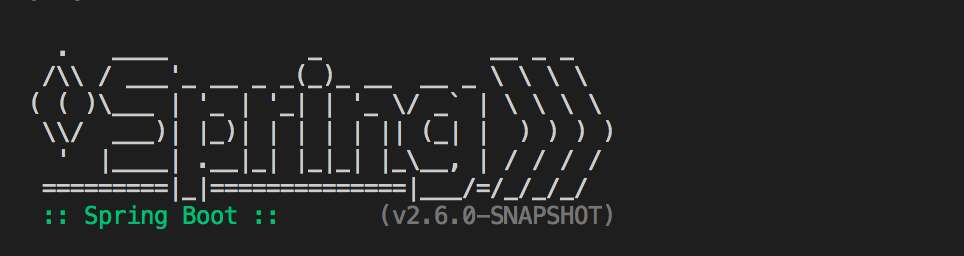

# Minicurso Java (API)



This project is a Spring Boot and Java application for managing users and tasks.

## Introduction

[Java Minicourse](https://app.rocketseat.com.br/classroom/minicurso-java) is an initiative by [Rocketseat](https://app.rocketseat.com.br/) to learn basic Java concepts.

## Features

[User]
- [X] CREATE User
- [] READ   User
- [] UPDATE User
- [] DELETE User

[Tasks]
- [X] CREATE Task
- [X] READ   Task
- [X] UPDATE Task
- [] DELETE Task

## DEMO

The application DEMO can be finding here: [APPLICATION DEMO](https://todolist-java-ar2s.onrender.com/).

## Technologies

This project was developed using Java + Spring Boot.

The project dependencies were:

```xml
<!-- Ferramentas de Desenvolvimento -->
<dependency>
    <groupId>org.springframework.boot</groupId>
    <artifactId>spring-boot-devtools</artifactId>
    <version>3.2.1</version>
    <optional>true</optional>
</dependency>

<!-- Atuadores para Monitoramento -->
<dependency>
    <groupId>org.springframework.boot</groupId>
    <artifactId>spring-boot-starter-actuator</artifactId>
</dependency>

<!-- Web Starter para Construção de APIs REST -->
<dependency>
    <groupId>org.springframework.boot</groupId>
    <artifactId>spring-boot-starter-web</artifactId>
</dependency>

<!-- Testes Automatizados -->
<dependency>
    <groupId>org.springframework.boot</groupId>
    <artifactId>spring-boot-starter-test</artifactId>
    <scope>test</scope>
</dependency>

<!-- JPA para Acesso a Dados com Hibernate -->
<dependency>
    <groupId>org.springframework.boot</groupId>
    <artifactId>spring-boot-starter-data-jpa</artifactId>
</dependency>

<!-- Banco de Dados H2 em Tempo de Execução -->
<dependency>
    <groupId>com.h2database</groupId>
    <artifactId>h2</artifactId>
    <scope>runtime</scope>
</dependency>

<!-- Biblioteca Bcrypt para Criptografia de Senhas -->
<dependency>
    <groupId>at.favre.lib</groupId>
    <artifactId>bcrypt</artifactId>
    <version>0.10.2</version>
</dependency>

<!-- Projeto Lombok para Redução de Código Boilerplate -->
<dependency>
    <groupId>org.projectlombok</groupId>
    <artifactId>lombok</artifactId>
    <version>1.18.30</version>
    <scope>provided</scope>
</dependency>
```

## Getting Started


### Docker

To start the project run using docker:


[Image]
```shell
docker build -t todolist:rocketseat .
```

[Run]
```shell
docker run -p 8081:8081 todolist:rocketseat
```

Access[http://localhost:8081](http://localhost:8081) and 😝 Enjoy!!

### Development

To start the project run local:

```shell
mvn spring-boot:run
```

Access[http://localhost:8081](http://localhost:8081) and 😝 Enjoy!!

## What I Learned with This Project?


## Acknowledgment

Thanks to [Rocketseat](https://app.rocketseat.com.br/) for the content and initiatives it provides.🚀